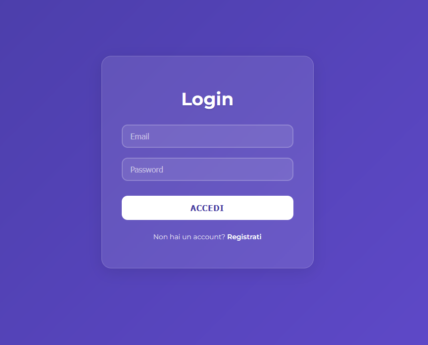
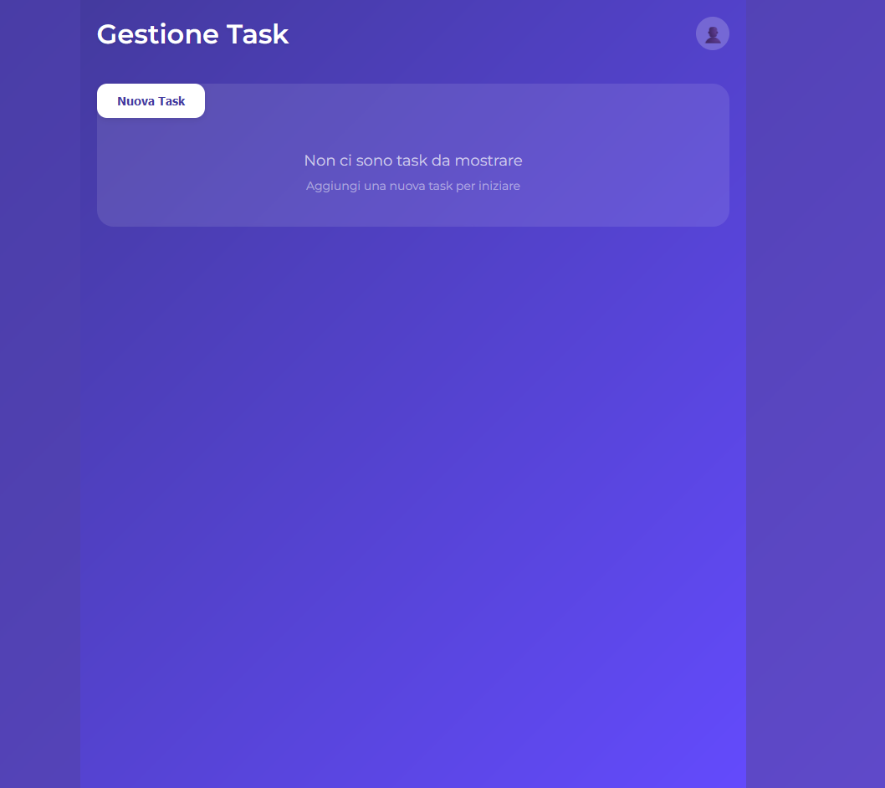
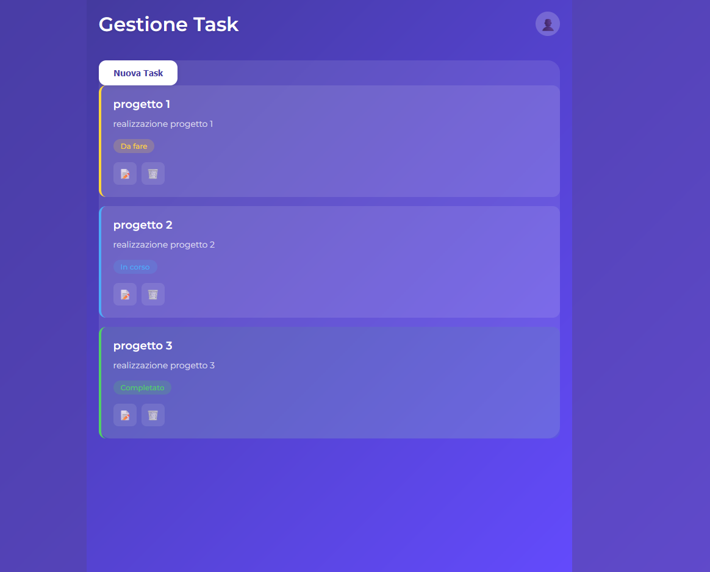

# Task Management Platform

Una piattaforma moderna per la gestione delle attività (task) con autenticazione degli utenti e persistenza dei dati.

## Caratteristiche

- **Autenticazione Utente**: Sistema completo di registrazione e login
- **Gestione Task Personali**: Ogni utente può gestire le proprie task
- **Sicurezza**: Utilizzo di JWT per proteggere le API
- **Persistenza Dati**: Salvataggio delle task su database SQLite
- **Stato Task**: Gestione dello stato delle task (todo, in progress, completed)

## Tecnologie Utilizzate

- **Frontend**:
  - React.js
  - Axios per le chiamate API
  - CSS per lo styling

- **Backend**:
  - Node.js con Express
  - SQLite per il database
  - JWT per l'autenticazione

## Installazione

1. Clona il repository:
```bash
git clone [url-del-repository]
```

2. Installa le dipendenze:
```bash
cd taskManagement--
npm install
```

3. Avvia il server backend:
```bash
cd src/backend
node server.js
```

4. In un nuovo terminale, avvia l'applicazione React:
```bash
npm start
```

## Struttura del Progetto

```
taskManagement--/
├── src/
│   ├── backend/
│   │   └── server.js
│   ├── pages/
│   │   ├── login.jsx
│   │   ├── mainPage.jsx
│   │   └── register.jsx
│   ├── auth.css
│   └── mainPage.css
├── package.json
└── README.md
```

## Foto del progetto







## API Endpoints

### Autenticazione
- `POST /register` - Registrazione nuovo utente
- `POST /login` - Login utente

### Task
- `GET /api/tasks` - Ottiene tutte le task dell'utente
- `POST /api/tasks` - Crea una nuova task
- `PUT /api/tasks/:id` - Aggiorna una task esistente
- `DELETE /api/tasks/:id` - Elimina una task

## Funzionalità

### Gestione Task
- Creazione di nuove task con titolo, descrizione e data di scadenza
- Visualizzazione di tutte le task personali
- Modifica delle task esistenti
- Eliminazione delle task
- Aggiornamento dello stato delle task

### Sistema di Autenticazione
- Registrazione nuovo utente
- Login con email e password
- Token JWT per mantenere la sessione
- Protezione delle route API

## Sicurezza
- Password degli utenti salvate nel database
- Token JWT per autenticare le richieste API
- Validazione dei dati in input
- Protezione contro accessi non autorizzati alle task

## Sviluppi Futuri
- [ ] Implementazione di categorie per le task
- [ ] Filtri e ricerca avanzata
- [ ] Condivisione task tra utenti
- [ ] Notifiche per le scadenze
- [ ] Tema chiaro/scuro
- [ ] Supporto per file allegati

## Licenza
MIT License

Copyright (c) 2024 Giuseppe Falliti
